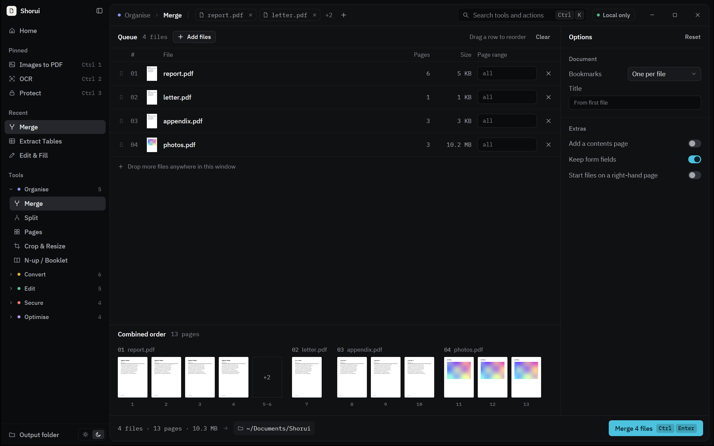
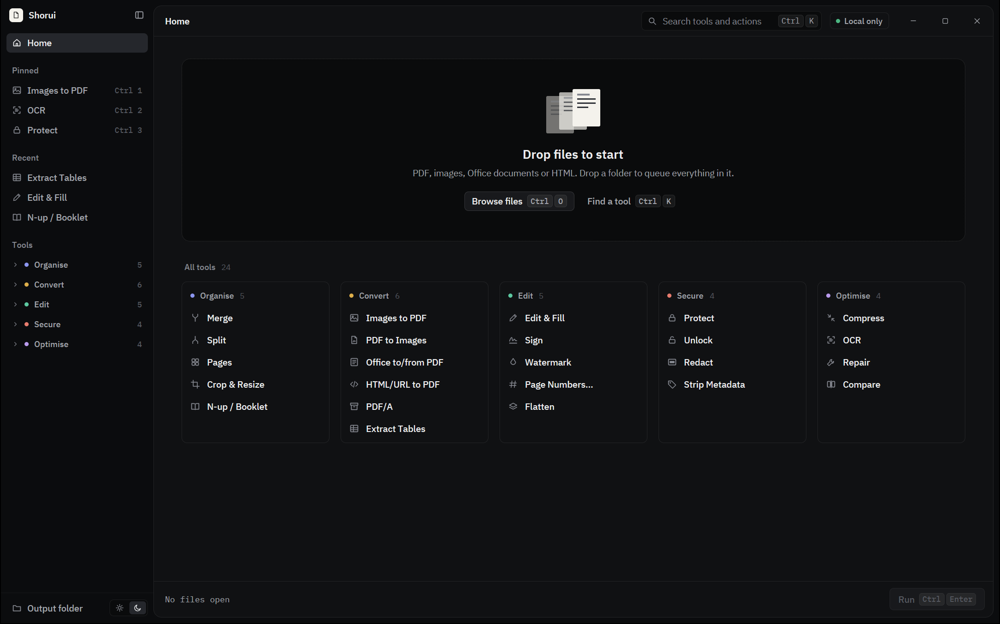
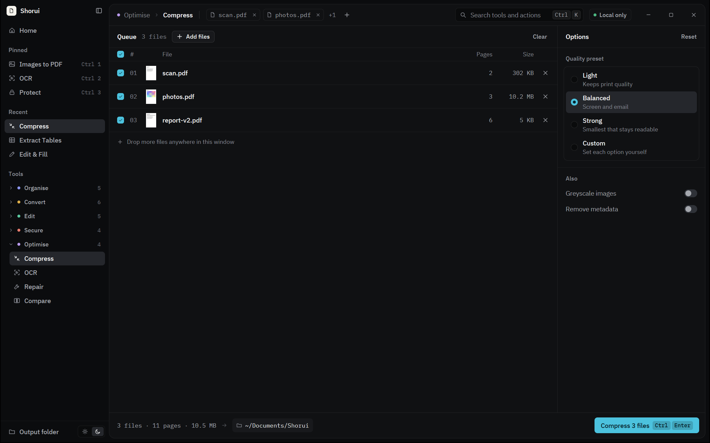
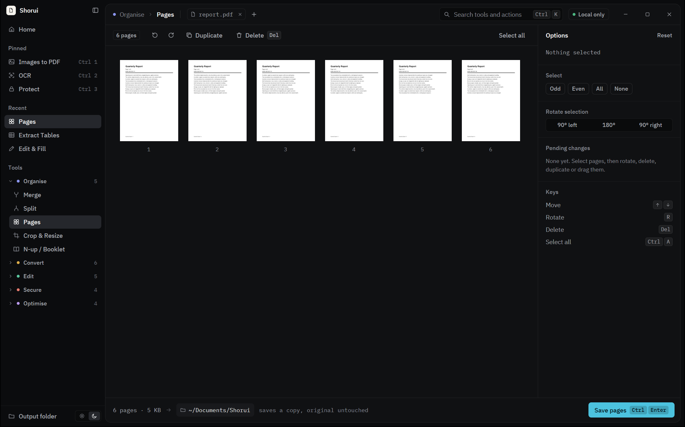
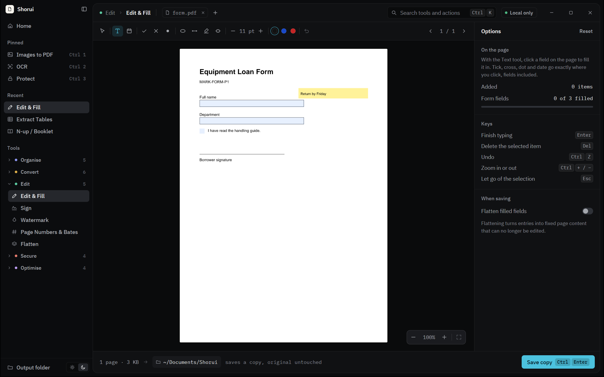
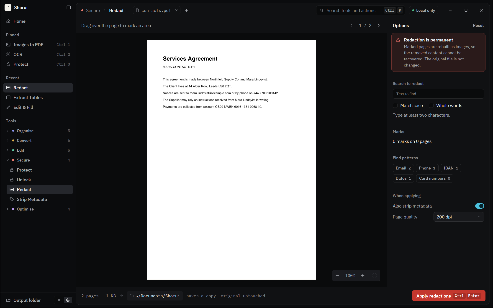
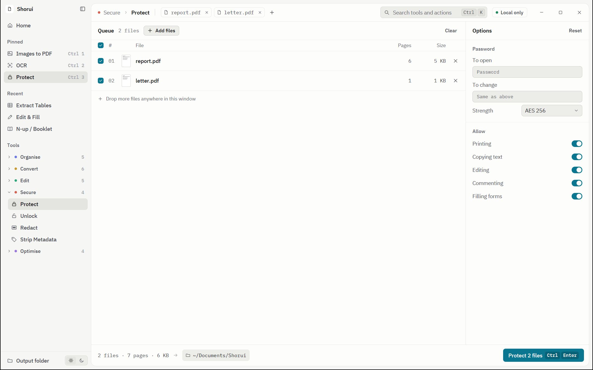

# Shorui

**An offline, all-in-one PDF toolbox for the desktop.** Merge, split, compress, fill, sign,
redact, convert and more: 25 tools in one window. Every tool runs on your machine, and files
are never uploaded.

Built in Rust with [GPUI](https://gpui.rs) and [gpui-kit](https://gpui-kit.com).



## Why Shorui

- **Local only.** Files are read and written on disk here. The one exception is HTML/URL to PDF,
  and only when you give it a web address.
- **One window, every tool.** No separate apps and no browser tabs. Open a tool, drop files, run.
- **Keyboard first.** `Ctrl+K` reaches every tool and action, `Ctrl+Enter` runs, and `G` then a
  letter jumps straight to a tool.
- **Originals are never changed.** Each run saves a copy, and asks where: a file name for one
  result, a folder for several. Save dialogs open in the folder you used last.

## The tools

| Group | Tools |
| --- | --- |
| Organise | Merge, Split, Pages (reorder, rotate, delete), Crop & Resize, N-up / Booklet |
| Convert | Images to PDF, PDF to Images, Office to/from PDF, HTML/URL to PDF, CSV to PDF, PDF/A, Extract Tables |
| Edit | Edit & Fill, Sign, Watermark, Page Numbers & Bates, Flatten |
| Secure | Protect, Unlock, Redact, Strip Metadata |
| Optimise | Compress, OCR, Repair, Compare |

## A look around

### Start anywhere

Drop files or a whole folder onto the window, or pick a tool first. Favourite and recent tools sit
in the sidebar.



### Queue tools: set a few options, run

Batch tools share one layout: the file queue, an options panel on the right, and a run line at
the bottom showing what goes in, where it goes, and the single action.



### Work on the pages themselves

<table>
  <tr>
    <td width="50%">
      
      <p><strong>Pages.</strong> Reorder, rotate, duplicate and delete pages from a thumbnail grid. Select odd or even pages in one click.</p>
    </td>
    <td width="50%">
      
      <p><strong>Edit &amp; Fill.</strong> Click a form field to fill it where it sits, or type, tick and date anywhere on the page.</p>
    </td>
  </tr>
  <tr>
    <td width="50%">
      
      <p><strong>Redact.</strong> Drag over the page, search for text, or find emails, phone numbers, IBANs, dates and card numbers. Marked pages are rebuilt as images, so redacted content is really gone.</p>
    </td>
    <td width="50%">
      
      <p><strong>Light and dark.</strong> Both themes are complete. Switch with <code>Ctrl+Shift+L</code>.</p>
    </td>
  </tr>
</table>

## Install

One command on each system. Nothing needs administrator rights.

**Windows** (PowerShell):

```powershell
irm https://raw.githubusercontent.com/voidwright07/shorui/main/install.ps1 | iex
```

**macOS** (Apple Silicon or Intel) and **Linux** (x86_64 or arm64):

```sh
curl -fsSL https://raw.githubusercontent.com/voidwright07/shorui/main/install.sh | sh
```

- **Windows:** installs for your user, with a Start menu entry and "Open with" for PDFs.
  Remove it under Settings > Apps.
- **macOS:** the app goes to `/Applications`, or `~/Applications` when that is not writable.
- **Linux:** the app goes to `~/.local`, with an entry in your applications menu. It needs
  glibc 2.35 or newer (Ubuntu 22.04, Debian 12, Fedora 36 or later) and Vulkan graphics. The
  script lists any missing libraries and the command that installs them.

To remove Shorui, run the same command with `sh -s -- --uninstall` on macOS or Linux. On
Windows, set `$env:SHORUI_UNINSTALL='1'` first. Settings are kept. To install a particular
release, use `sh -s -- --version v0.1.0` or `$env:SHORUI_VERSION='v0.1.0'`.

Prefer a file? Each [release](https://github.com/voidwright07/shorui/releases) has a `.msi`
for Windows and a `.dmg` for macOS.

## Build and run

Needs Rust 1.93 or newer (the repository pins 1.98 in `rust-toolchain.toml`).

```bash
cargo run --release -p shorui
```

Open with files and a tool already chosen:

```bash
cargo run --release -p shorui -- --tool compress report.pdf scan.pdf
```

Other launch options: `--theme light|dark` and `--size 1440x900`.

Platform notes:

- **Windows**: Visual Studio 2022 Build Tools with "Desktop development with C++".
- **macOS**: Xcode command line tools.
- **Linux**: the usual GPUI packages (Vulkan, fontconfig, wayland or X11 development headers).

Only the Windows build has been run and tested so far. The interface has no Windows-only
code; the platform-specific helpers are listed below.

### Making a release

Push a version tag. GitHub Actions (`.github/workflows/release.yml`) builds every package and
publishes them as a release, which the install commands above then fetch:

```sh
git tag v0.1.0
git push origin v0.1.0
```

The tag must match `version` in `Cargo.toml`. To try the builds without publishing, run the
**Release** workflow by hand from the Actions tab; the files are kept as workflow artifacts.

| Package | Built on | Script |
| --- | --- | --- |
| `Shorui-windows-x64.msi`, `shorui-windows-x64.zip` | Windows | `installer\build.ps1` (WiX Toolset 5) |
| `Shorui-macos-universal.dmg`, `shorui-macos-universal.tar.gz` | macOS (one app for Apple Silicon and Intel) | `installer/macos/package.sh` |
| `shorui-linux-x86_64.tar.gz`, `shorui-linux-aarch64.tar.gz` | Ubuntu 22.04 | `installer/linux/package.sh` |

Each script also runs locally on its own system. The Windows one needs the WiX command line
once per machine: `dotnet tool install --global wix --version 5.0.2`, then
`wix extension add -g WixToolset.UI.wixext/5.0.2` and `wix extension add -g WixToolset.Util.wixext/5.0.2`.

None of the packages are code-signed yet. On Windows, SmartScreen warns the first time a
downloaded `.msi` runs ("More info", then "Run anyway"). On macOS, the install command is not
affected, but an app opened from the `.dmg` needs right-click > Open the first time.

### Command line

Every operation is also available without the window, through `shorui-cli`:

```bash
shorui-cli run compress --out out.pdf in.pdf
```

## Tools that use a helper already on your machine

Most tools are pure Rust. Three need a helper that is already installed:

| Tool | Windows | macOS | Linux |
| --- | --- | --- | --- |
| OCR | Built-in Windows OCR | Tesseract | Tesseract |
| Office to/from PDF | LibreOffice, or Microsoft Office | LibreOffice | LibreOffice |
| HTML/URL to PDF | Edge, Chrome, Chromium or Brave | Chrome, Edge, Chromium or Brave | Chrome or Chromium |

PDF to Word works without a helper too: when LibreOffice is not installed, Shorui writes the
.docx itself with the text and page breaks only (no layout or pictures). Microsoft Word is used
for a PDF only when it is picked by name in the options, because Word shows its window while it
opens a PDF.

When a helper is missing, the tool says which one and how to get it.

## Shortcuts

| Keys | Action |
| --- | --- |
| `Ctrl/Cmd K` | Command palette |
| `Ctrl/Cmd O` | Add files |
| `Ctrl/Cmd Enter` | Run the current tool |
| `G` then a letter | Jump to a tool (`G M` Merge, `G C` Compress; the palette shows each one) |
| `Ctrl/Cmd 1` to `3` | Favourite tools (star a tool in the sidebar or the top bar) |
| `Ctrl/Cmd +`, `−`, `0` | Zoom the page in Edit & Fill, Sign and Redact (also `Ctrl/Cmd` with the wheel, or a touchpad pinch) |
| `Ctrl/Cmd B` | Collapse or expand the sidebar |
| `Ctrl/Cmd Shift L` | Light or dark theme |
| `Esc` | Cancel a run, close a menu |

## Project layout

- `crates/shorui-core`: every PDF operation, no UI. Also `shorui-cli`, a thin command line over
  the same functions.
- `crates/shorui`: the window. `shell.rs` is the frame, `view_*.rs` draw the pieces,
  `catalog.rs` holds the tool list and the schema that draws each options panel, and
  `palette*.rs` is the command palette.
- `.interface-design/system.md`: the design system the interface follows.
- `docs/gpui-kit-cheatsheet.md`: notes on the UI library's API.
- `docs/screenshots/`: the images in this README.

## Tests

```bash
cargo test --workspace
```

- `crates/shorui-core/tests/`: each tool on generated PDFs, with the results read back.
- `crates/shorui/src/tool_runs.rs`: every tool driven through the same path the window uses.
- `crates/shorui/src/ui_tests.rs`: the palette, shortcuts and the page tools in a headless
  window with real key and pointer dispatch.

Test PDFs are generated, not checked in:

```bash
cargo run -p shorui-core --bin shorui-cli -- fixtures testdata
```

## Fonts

IBM Plex Sans and IBM Plex Mono, under the SIL Open Font License
(`crates/shorui/assets/fonts/OFL.txt`).
